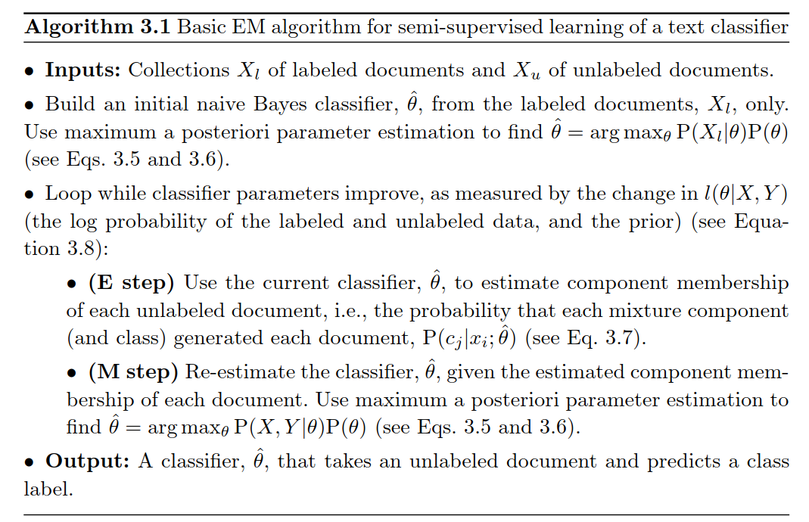

# semi-supervised-bayesian-classifier
Modified Naive Bayes for semi-supervised learning 

## Overview

The Naive Bayes classifier is known to work well on NLP tasks such as documents classification, after the documents have been vectorized using for instance a bag-of-words or word count embedding. However, in the presence of a small number of labelled documents and a large number of unlabelled documents, would it be possible to 'tweak' regular Naive Bayes in order to take advantage of the vast amount of unlabelled data? We consider here the results of Nigam et al. (Semi-supervised text classification using EM, available in the book simply called ['Semi-supervised learning'](https://mitpress.mit.edu/books/semi-supervised-learning)). 

## A generative model for documents

We build a generative model for documents, whose intuition is quite simple: 

1) if we have m classes (m labels to predict), we throw a m-sided biased dice to predict the class of that document

3) we throw the V-sided biased dice related to this label (V is the size of the vocabulary) |x_i| times, where |x_i| is the length of document i

3) count the number of times that each word appears to get a 'word count' representation

Technically speaking, we have a mixture model over the m label components and we want to learn the parameters that maximize the model's  likelihood

## Algorithm pseudo-code

Here is the pseudo code of the algorithm used. For more details, check the section by  Nigam et al., Semi-supervised text classification using EM, available in the book 'Semi-supervised learning'. The idea behind it is quite simple.

* Train a Naive Bayes classifier on the labelled part of the dataset.

* Use the learnt weights to make predictions on the unlabelled part of the data set.

* The predictions can be transformed into labels and be used to train a new classifier using the previously unlabelled part of the data set with the 'synthetic labels'

* repeat the procedure untill the value of the model total likelihood does not decrease anymore (likelihood is computed using the full dataset).

## Training

cd to the project directory and execute

`python main.py`

The default dataset is the Standford Movie review data set. The results show that the total likelihood decreases up to a certain point and then stabilize, when 'all the juice' has been extracted from the unlabelled data.
